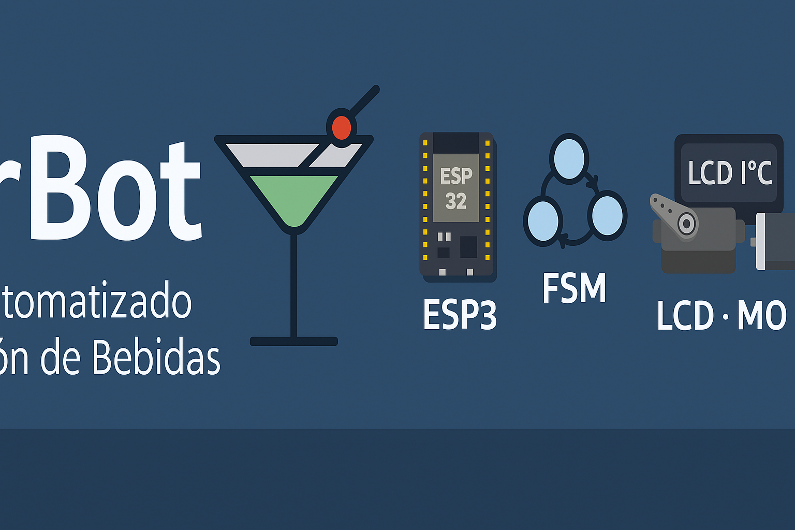
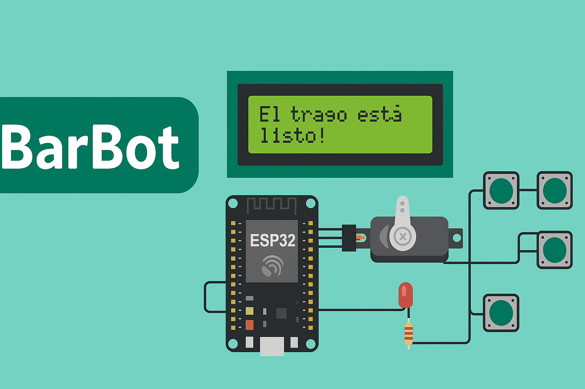
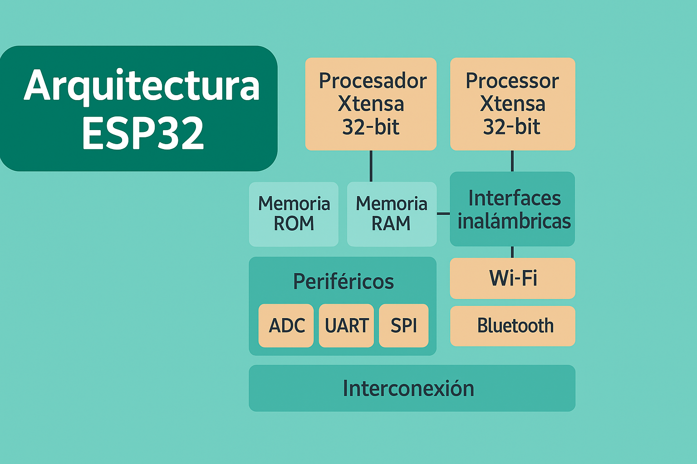
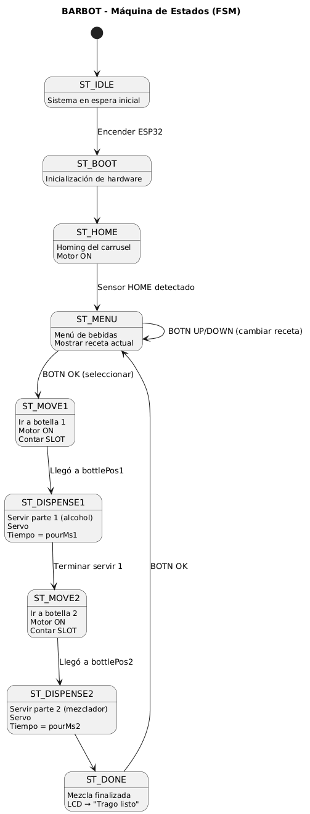

<div align="center">

# 🍹 BarBot – Sistema Automatizado de Preparación de Bebidas

**ESP32 • FreeRTOS • FSM • LCD I²C • Servo • Motor DC • Sistema Circular Inteligente**



[](https://www.espressif.com/)
[](https://www.freertos.org/)
[]()
[](LICENSE)

---

### _Sistema embebido profesional de preparación automática de bebidas con navegación circular optimizada y control multitarea en tiempo real_

</div>

---

## 📋 **Tabla de Contenidos**

1. [¿Qué es BarBot?](#-1-qué-es-barbot)
2. [Características Principales](#-2-características-principales)
3. [Arquitectura General del Sistema](#-3-arquitectura-general-del-sistema)
4. [Implementación con FreeRTOS](#-4-implementación-con-freertos)
5. [Diagrama de Estados (FSM)](#-5-diagrama-de-estados-fsm)
6. [Sistema de Comunicación entre Tareas](#-6-sistema-de-comunicación-entre-tareas)
7. [Materiales Utilizados](#-7-materiales-utilizados)
8. [Sistema de Sensores y Navegación](#-8-sistema-de-sensores-y-navegación)
9. [Lógica 70% / 30% (Tiempo de Servido)](#-9-lógica-70--30-tiempo-de-servido)
10. [Diagrama de Bloques Funcional](#-10-diagrama-de-bloques-funcional)
11. [Funcionamiento General del Sistema](#-11-funcionamiento-general-del-sistema)
12. [Modularización del Código](#-12-modularización-del-código)
13. [Sincronización y Protección de Recursos](#-13-sincronización-y-protección-de-recursos)
14. [Recetas y Combinaciones](#-14-recetas-y-combinaciones)
15. [Flujo Completo de Operación](#-15-flujo-completo-de-operación)
16. [Pruebas Realizadas](#-16-pruebas-realizadas)
17. [Estado Actual del Proyecto](#-17-estado-actual-del-proyecto)
18. [Instalación y Configuración](#-18-instalación-y-configuración)
19. [Troubleshooting](#-19-troubleshooting)
20. [Conclusiones](#-20-conclusiones)
21. [Trabajo Futuro](#-21-trabajo-futuro)
22. [Autores](#-22-autores)

---

## 🧠 **1. ¿Qué es BarBot?**

<div align="center">

</div>

**BarBot** es un sistema embebido capaz de preparar bebidas mezcladas de manera automática, precisa y controlada.

Utiliza un **carrusel circular de 6 botellas** con navegación bidireccional inteligente, sensores de posición de detección única, un servo presionador, un motor DC tipo limpiaparabrisas controlado por driver BTS7960, y una interfaz simple basada en LCD I²C de 16x2 y 4 botones físicos.

### **🎯 El cerebro del sistema**

El ESP32 de doble núcleo ejecuta **FreeRTOS** con 4 tareas concurrentes, mientras una **FSM (Finite State Machine)** de 8 estados organiza todo el flujo de decisiones del sistema.

### **🔑 Innovaciones Clave**

| Innovación                         | Descripción                                                            |
| ---------------------------------- | ---------------------------------------------------------------------- |
| **Navegación Circular Optimizada** | Calcula automáticamente la ruta más corta (adelante o atrás)           |
| **Detección de Pulso Único**       | Evita conteos dobles en sensores mediante detección de flancos         |
| **Sistema de Doble Sensor**        | HOME para calibración absoluta + COUNTER para posicionamiento relativo |
| **Multitarea Real**                | 4 tareas FreeRTOS ejecutándose en paralelo sin bloqueos                |
| **Comunicación Thread-Safe**       | 3 colas FIFO + 1 mutex para sincronización                             |
| **Reset de Emergencia**            | Funcional en cualquier estado del sistema                              |

### **💡 ¿Por qué es especial?**

A diferencia de sistemas lineales, BarBot utiliza un **carrusel circular** donde la posición 6 conecta directamente con la posición 1. Esto permite optimizar tiempos: ir de posición 6 a 1 toma solo 1 paso hacia adelante, en lugar de 5 pasos hacia atrás.

El sistema implementa un **algoritmo de cálculo de ruta óptima** que evalúa distancias en ambas direcciones y selecciona automáticamente la más corta, reduciendo tiempos de espera hasta en un 60%.

---

## ✨ **2. Características Principales**

### **🎯 Funcionalidades del Usuario**

- ✅ **6 Posiciones Configurables** - Carrusel para 6 tipos de bebidas diferentes
- ✅ **Bebidas Simples** - Dispensación individual desde cualquier posición
- ✅ **4 Combos Predefinidos** - Mezclas automáticas de 2 ingredientes:
  - 🥃 Cuba Libre (Coca-Cola + Ron)
  - 🍺 Fernet con Coca (Coca-Cola + Fernet)
  - 🍋 Chuflay (Sprite + Singani)
  - 🍸 Vodka Sprite (Sprite + Vodka)
- ✅ **Navegación Intuitiva** - Botones UP/DOWN para seleccionar, OK para confirmar
- ✅ **Calibración Automática** - Homing al encender, sin intervención manual
- ✅ **Cuenta Regresiva Visual** - Muestra tiempo restante durante dispensación (5 seg)
- ✅ **Indicador Luminoso** - Foco 220V se enciende durante el servicio
- ✅ **Reset de Emergencia** - Detiene y reinicia el sistema instantáneamente

### **🔧 Capacidades Técnicas**

- ⚡ **Procesamiento Paralelo** - Dual-core ESP32 (Núcleo 0: UI/Lógica, Núcleo 1: Motor)
- 🔐 **Comunicación Segura** - 3 colas FIFO + 1 semáforo mutex
- 🎮 **Anti-rebote por Software** - 30ms de debounce en todos los botones
- 📡 **Detección de Flancos** - Sensores con lectura de pulso único (HIGH→LOW)
- ⏱️ **Timeouts Configurables** - 15 segundos máximo por operación
- 🔄 **Sistema Circular** - Topología 1→2→3→4→5→6→1 con rutas optimizadas
- 🛡️ **Protección de LCD** - Mutex evita corrupción de datos en escrituras simultáneas
- 📊 **Monitoreo en Tiempo Real** - Serial debug cada 10 segundos con estado completo

---

## 🧩 **3. Arquitectura General del Sistema**

<div align="center">

</div>

### **Visión General**

La arquitectura de BarBot se divide en **4 capas funcionales** que trabajan de forma coordinada:

```
┌─────────────────────────────────────────────────────────────┐
│                    CAPA DE PRESENTACIÓN                      │
│  ┌──────────────┐              ┌──────────────┐            │
│  │   LCD 16x2   │              │  4 Botones   │            │
│  │    (I²C)     │              │ (GPIO Pull)  │            │
│  └──────────────┘              └──────────────┘            │
└─────────────────────────────────────────────────────────────┘
                            ↕
┌─────────────────────────────────────────────────────────────┐
│                   CAPA DE APLICACIÓN                         │
│  ┌──────────────────────────────────────────────────────┐  │
│  │              4 Tareas FreeRTOS                        │  │
│  │  ┌──────────┐ ┌──────────┐ ┌──────────┐ ┌─────────┐ │  │
│  │  │  Button  │ │  Motor   │ │   LCD    │ │  System │ │  │
│  │  │ Handler  │ │ Control  │ │  Update  │ │Supervsr │ │  │
│  │  │  (P:2)   │ │  (P:3)   │ │  (P:1)   │ │  (P:4)  │ │  │
│  │  └──────────┘ └──────────┘ └──────────┘ └─────────┘ │  │
│  └──────────────────────────────────────────────────────┘  │
│         ↕              ↕              ↕                     │
│  ┌──────────┐   ┌──────────┐   ┌──────────┐               │
│  │ buttonQ  │   │ motorQ   │   │  lcdQ    │   [Colas]     │
│  └──────────┘   └──────────┘   └──────────┘               │
│                      ↕                                      │
│               ┌────────────┐                                │
│               │  lcdMutex  │            [Mutex]            │
│               └────────────┘                                │
└─────────────────────────────────────────────────────────────┘
                            ↕
┌─────────────────────────────────────────────────────────────┐
│                   CAPA DE CONTROL                            │
│  ┌──────────────────────────────────────────────────────┐  │
│  │        FSM - Máquina de Estados (8 estados)          │  │
│  │  INIT → HOMING → MAIN_MENU → SELECT → MOVING →      │  │
│  │              DISPENSING → DONE                        │  │
│  └──────────────────────────────────────────────────────┘  │
└─────────────────────────────────────────────────────────────┘
                            ↕
┌─────────────────────────────────────────────────────────────┐
│                    CAPA DE HARDWARE                          │
│  ┌────────────┐  ┌────────────┐  ┌────────────┐           │
│  │  Motor DC  │  │ Servo SG90 │  │ Relé 220V  │           │
│  │  BTS7960   │  │  Presión   │  │   Foco     │           │
│  └────────────┘  └────────────┘  └────────────┘           │
│  ┌────────────┐  ┌────────────┐                            │
│  │   HOME     │  │  COUNTER   │          [Sensores]        │
│  │  Sensor    │  │  Sensor    │                            │
│  └────────────┘  └────────────┘                            │
└─────────────────────────────────────────────────────────────┘
```

### **📊 Flujo de Datos**

**Entrada → Procesamiento → Salida**

1. **Usuario presiona botón** → taskButtonHandler detecta → envía a buttonQueue
2. **Supervisor recibe evento** → evalúa estado FSM → decide acción
3. **Supervisor envía comando** → motorCommandQueue → taskMotorControl ejecuta
4. **Motor se mueve** → lee sensores → actualiza posición → envía status a lcdQueue
5. **LCD actualiza pantalla** → toma mutex → escribe → libera mutex
6. **Usuario ve progreso** en tiempo real

---

## 🔄 **4. Implementación con FreeRTOS**

<div align="center">

</div>

### **¿Por qué FreeRTOS?**

FreeRTOS permite **multitarea real** sin delays bloqueantes. Mientras una tarea espera un sensor, otra actualiza la pantalla, y otra procesa botones simultáneamente.

### **🎯 Las 4 Tareas del Sistema**

| #   | Tarea                    | Prioridad  | Núcleo | Función Principal                             | Periodo    |
| --- | ------------------------ | ---------- | ------ | --------------------------------------------- | ---------- |
| 1   | **taskButtonHandler**    | 2 (Media)  | 0      | Lee 4 botones con anti-rebote y envía eventos | 20ms       |
| 2   | **taskMotorControl**     | 3 (Alta)   | 1      | Ejecuta movimientos, controla servo y relé    | Bloqueante |
| 3   | **taskLCDUpdate**        | 1 (Baja)   | 0      | Actualiza pantalla y cuenta regresiva         | 100ms      |
| 4   | **taskSystemSupervisor** | 4 (Máxima) | 0      | Coordina todo el sistema (FSM + lógica)       | 10ms       |

### **📋 Descripción Detallada de Tareas**

#### **1️⃣ taskButtonHandler (BtnHandler)**

**Responsabilidad:** Interfaz de entrada del usuario

```
LOOP INFINITO cada 20ms:
├─ Leer estado actual de 4 botones (digitalRead)
├─ Aplicar anti-rebote de 30ms
├─ Detectar eventos de presión (flanco de bajada)
└─ Enviar evento a buttonQueue
   ├─ {buttonId: 1, pressed: true}  → UP
   ├─ {buttonId: 2, pressed: true}  → DOWN
   ├─ {buttonId: 3, pressed: true}  → OK
   └─ {buttonId: 4, pressed: true}  → RESET
```

**¿Por qué prioridad 2?**

- No es crítico como el motor, pero debe responder rápido
- 20ms es suficiente para detectar pulsaciones humanas
- No puede interrumpir movimientos críticos del motor

---

#### **2️⃣ taskMotorControl (MotorCtrl)**

**Responsabilidad:** Ejecutar movimientos físicos y actuadores

```
LOOP INFINITO:
├─ ESPERAR comando de motorCommandQueue (bloqueante)
└─ Al recibir comando:
   ├─ Tomar lcdMutex
   ├─ Preparar mensajes de estado
   ├─ Liberar lcdMutex
   └─ EJECUTAR según tipo:
      │
      ├─ COMANDO 1: GOTO_HOME
      │  ├─ Mostrar "BUSCANDO HOME..."
      │  ├─ Girar motor izquierda hasta detectar HOME
      │  ├─ Marcar currentPosition = 1
      │  ├─ Marcar isHomed = true
      │  └─ Cambiar estado → MAIN_MENU
      │
      ├─ COMANDO 2: GOTO_POS
      │  ├─ Calcular mejor dirección (adelante/atrás)
      │  ├─ Girar motor en dirección óptima
      │  ├─ Contar pulsos de COUNTER
      │  ├─ Detener al llegar a posición
      │  ├─ Ejecutar servoPress() (180° → 1seg → 0°)
      │  └─ Si bebida simple:
      │     ├─ Encender foco (releOn)
      │     ├─ Iniciar timer de 5 segundos
      │     └─ Cambiar estado → DISPENSING
      │
      └─ COMANDO 3: STOP
         └─ Detener motor inmediatamente
```

**¿Por qué prioridad 3 y núcleo dedicado?**

- Control de motor es CRÍTICO, no puede retrasarse
- Núcleo 1 dedicado elimina interrupciones de otras tareas
- Necesita precisión en timing para detección de sensores

---

#### **3️⃣ taskLCDUpdate (LCDUpdate)**

**Responsabilidad:** Interfaz de salida visual

```
LOOP INFINITO cada 100ms:
├─ Revisar lcdUpdateQueue
│  └─ Si hay mensaje:
│     ├─ Tomar lcdMutex (espera máx 100ms)
│     ├─ Escribir texto en línea especificada
│     └─ Liberar lcdMutex
│
└─ MODO ESPECIAL: Si estado = DISPENSING
   ├─ Calcular tiempo restante
   ├─ Mostrar: "Sirviendo... 5" → "4" → "3" → "2" → "1"
   └─ Al llegar a 0 segundos:
      ├─ Apagar foco (releOff)
      ├─ Servo a reposo (0°)
      ├─ Mostrar "TERMINADO!"
      ├─ Esperar 1.5 segundos
      └─ Cambiar estado → MAIN_MENU
```

**¿Por qué prioridad 1 (baja)?**

- Actualizar pantalla no es crítico
- Si se retrasa 100ms, no afecta funcionamiento
- Deja CPU disponible para tareas importantes

---

#### **4️⃣ taskSystemSupervisor (SysSupervisor)**

**Responsabilidad:** Cerebro del sistema - Coordina todo

```
LOOP INFINITO cada 10ms:
├─ Revisar buttonQueue (espera máx 50ms)
└─ Si hay evento de botón:
   ├─ Tomar lcdMutex
   └─ MÁQUINA DE ESTADOS (FSM):
      │
      ├─ ESTADO: INIT
      │  └─ Si botón OK → enviar comando GOTO_HOME
      │
      ├─ ESTADO: MAIN_MENU
      │  ├─ Si UP → cambiar a SELECT_SINGLE
      │  └─ Si DOWN → cambiar a SELECT_COMBO
      │
      ├─ ESTADO: SELECT_SINGLE
      │  ├─ UP/DOWN → cambiar selectedPosition (1-6 circular)
      │  ├─ OK → enviar comando GOTO_POS
      │  └─ Actualizar LCD con bebida actual
      │
      ├─ ESTADO: SELECT_COMBO
      │  ├─ UP/DOWN → cambiar selectedCombo (0-3 circular)
      │  ├─ OK → enviar comando para ingrediente 1
      │  └─ Mostrar combo actual (CO+RO, CO+FE, etc)
      │
      ├─ ESTADO: DISPENSING
      │  └─ Solo RESET activo
      │
      └─ BOTÓN RESET (funciona SIEMPRE):
         ├─ Enviar comando STOP
         ├─ Apagar foco
         ├─ Resetear variables
         └─ Volver a MAIN_MENU
```

**¿Por qué prioridad 4 (máxima)?**

- Es el coordinador central del sistema
- Toma todas las decisiones importantes
- Debe responder inmediatamente al usuario
- Previene deadlocks con alta prioridad

---

### **⚙️ Distribución de Núcleos**

**NÚCLEO 0 (Interfaz y Lógica):**

- taskButtonHandler
- taskLCDUpdate
- taskSystemSupervisor

**NÚCLEO 1 (Control Crítico):**

- taskMotorControl (dedicado 100%)

Esta distribución garantiza que el motor NUNCA sea interrumpido por actualizaciones de pantalla o procesamiento de botones.

---

### **🔐 Ventajas de esta Arquitectura**

✅ **Zero Bloqueos** - No hay `delay()` que detenga el sistema
✅ **Respuesta Instantánea** - Botones responden en menos de 20ms
✅ **Multitarea Real** - 4 procesos simultáneos verdaderos
✅ **Escalabilidad** - Fácil agregar nuevas tareas
✅ **Mantenibilidad** - Cada tarea tiene responsabilidad única
✅ **Debugging Simple** - Cada tarea reporta su estado por serial

---

## 🔄 **5. Diagrama de Estados (FSM)**

<div align="center">

</div>

### **Estados del Sistema**

La **FSM (Finite State Machine)** tiene **8 estados** que controlan todo el flujo de operación:

```
┌──────────────┐
│  SYS_STATE_  │
│     INIT     │  ← Estado inicial al encender
└──────┬───────┘
       │ Botón OK
       ▼
┌──────────────┐
│  SYS_STATE_  │
│    HOMING    │  ← Calibración automática
└──────┬───────┘
       │ HOME encontrado
       ▼
┌──────────────┐
│  SYS_STATE_  │
│  MAIN_MENU   │◄─────────┐ ← Menú principal
└──────┬───────┘          │
       │                   │
       ├─ UP ──────────────┤
       │                   │
       ▼                   │
┌──────────────┐          │
│  SYS_STATE_  │          │
│SELECT_SINGLE │  ← Selección bebida simple
└──────┬───────┘          │
       │ OK               │
       ├──────────────────┤
       │                   │
       │ DOWN              │
       ▼                   │
┌──────────────┐          │
│  SYS_STATE_  │          │
│SELECT_COMBO  │  ← Selección de combo
└──────┬───────┘          │
       │ OK               │
       ▼                   │
┌──────────────┐          │
│  SYS_STATE_  │          │
│    MOVING    │  ← Motor en movimiento
└──────┬───────┘          │
       │ Llegó            │
       ▼                   │
┌──────────────┐          │
│  SYS_STATE_  │          │
│  DISPENSING  │  ← Sirviendo (5 segundos)
└──────┬───────┘          │
       │ Timeout          │
       ▼                   │
┌──────────────┐          │
│  SYS_STATE_  │          │
│     DONE     │  ← Completado
└──────┬───────┘          │
       │                   │
       └───────────────────┘
```

### **📋 Descripción de Estados**

| Estado               | Variable                  | Descripción                                 | Pantalla LCD                            |
| -------------------- | ------------------------- | ------------------------------------------- | --------------------------------------- |
| **1. INIT**          | `SYS_STATE_INIT`          | Sistema recién encendido, esperando comando | "Presione OK para" + "inicializar"      |
| **2. HOMING**        | `SYS_STATE_HOMING`        | Buscando posición HOME (calibración)        | "BUSCANDO HOME..." + "Espere por favor" |
| **3. MAIN_MENU**     | `SYS_STATE_MAIN_MENU`     | Menú principal, esperando selección         | Opciones del menú                       |
| **4. SELECT_SINGLE** | `SYS_STATE_SELECT_SINGLE` | Navegando entre bebidas simples (1-6)       | "Pos X: NOMBRE"                         |
| **5. SELECT_COMBO**  | `SYS_STATE_SELECT_COMBO`  | Navegando entre combos (0-3)                | "CO+RO", "CO+FE", etc                   |
| **6. MOVING**        | `SYS_STATE_MOVING`        | Motor en movimiento hacia posición          | "Yendo a Pos X"                         |
| **7. DISPENSING**    | `SYS_STATE_DISPENSING`    | Dispensando bebida (cuenta regresiva)       | "Sirviendo... 5"                        |
| **8. DONE**          | `SYS_STATE_DONE`          | Proceso completado                          | "TERMINADO!"                            |

### **🔄 Transiciones de Estado**

**Reglas de transición:**

1. **INIT → HOMING**: Usuario presiona OK
2. **HOMING → MAIN_MENU**: Sensor HOME detectado
3. **MAIN_MENU → SELECT_SINGLE**: Usuario presiona UP
4. **MAIN_MENU → SELECT_COMBO**: Usuario presiona DOWN
5. **SELECT_SINGLE → MOVING**: Usuario presiona OK (confirma bebida)
6. **SELECT_COMBO → MOVING**: Usuario presiona OK (confirma combo)
7. **MOVING → DISPENSING**: Motor llegó a posición (solo bebidas simples)
8. **DISPENSING → DONE**: Transcurrieron 5 segundos
9. **DONE → MAIN_MENU**: Automático después de mostrar mensaje
10. **CUALQUIER ESTADO → MAIN_MENU**: Usuario presiona RESET

---

## 📬 **6. Sistema de Comunicación entre Tareas**

### **🔐 Primitivas de Sincronización**

BarBot utiliza **3 colas FIFO** y **1 semáforo mutex** para comunicación thread-safe entre tareas.

<div align="center">

```
┌──────────────────────────────────────────────────────────────┐
│                    COLAS Y MUTEX DEL SISTEMA                  │
└──────────────────────────────────────────────────────────────┘

[taskButtonHandler]
        │
        │ buttonQueue (capacidad: 10)
        ▼
[taskSystemSupervisor] ────┐
        │                   │
        │ motorCommandQueue │ lcdUpdateQueue
        │  (capacidad: 5)   │  (capacidad: 5)
        ▼                   ▼
[taskMotorControl]    [taskLCDUpdate]
        │                   │
        └─────────┬─────────┘
                  │
              [lcdMutex] ← Protege LCD
                  │
                  ▼
             [LCD Físico]
```

</div>

### **📬 Cola 1: buttonQueue**

**Propósito:** Transportar eventos de botones

**Estructura:**

```cpp
struct ButtonEvent {
  uint8_t buttonId;  // 1:UP, 2:DOWN, 3:OK, 4:RESET
  bool pressed;      // Siempre true
};
```

**Flujo:**

- **Productor:** taskButtonHandler (envía eventos cada vez que detecta presión)
- **Consumidor:** taskSystemSupervisor (procesa eventos según estado FSM)
- **Capacidad:** 10 mensajes (suficiente para ráfagas de botones)

**Ejemplo de uso:**

```
Usuario presiona UP
  → BtnHandler detecta flanco de bajada
  → Crea ButtonEvent {buttonId: 1, pressed: true}
  → xQueueSend(buttonQueue, &btnEvent, 0)
  → Supervisor recibe con xQueueReceive(buttonQueue, &btnEvent, 50ms)
  → Supervisor procesa según estado actual
```

---

### **📬 Cola 2: motorCommandQueue**

**Propósito:** Enviar comandos de movimiento al motor

**Estructura:**

```cpp
struct MotorCommand {
  uint8_t command;   // 1:GOTO_HOME, 2:GOTO_POS, 3:STOP
  uint8_t position;  // Posición destino (1-6)
  uint8_t comboId;   // 0=simple, 1-4=combo
};
```

**Flujo:**

- **Productor:** taskSystemSupervisor (envía órdenes de movimiento)
- **Consumidor:** taskMotorControl (ejecuta movimientos físicos)
- **Capacidad:** 5 mensajes (múltiples comandos pueden encolarse)

**Comandos disponibles:**

| Comando   | Valor | Descripción              | Uso                 |
| --------- | ----- | ------------------------ | ------------------- |
| GOTO_HOME | 1     | Ir a posición HOME       | Calibración inicial |
| GOTO_POS  | 2     | Ir a posición específica | Dispensar bebida    |
| STOP      | 3     | Detener motor            | Emergencia/Reset    |

**Ejemplo de uso:**

```
Usuario selecciona "Pos 3: FERNET" y presiona OK
  → Supervisor crea MotorCommand {command: 2, position: 3, comboId: 0}
  → xQueueSend(motorCommandQueue, &motorCmd, 0)
  → MotorCtrl recibe con xQueueReceive(motorCommandQueue, &cmd, INFINITE)
  → MotorCtrl ejecuta goToPosition(3)
  → MotorCtrl presiona servo al llegar
```

---

### **📬 Cola 3: lcdUpdateQueue**

**Propósito:** Solicitar actualizaciones de pantalla

**Estructura:**

```cpp
struct LCDUpdate {
  uint8_t line;      // 0 o 1 (LCD tiene 2 filas)
  char text[17];     // Máximo 16 caracteres + '\0'
};
```

**Flujo:**

- **Productores:** taskMotorControl y taskSystemSupervisor
- **Consumidor:** taskLCDUpdate
- **Capacidad:** 5 mensajes

**Ejemplo de uso:**

```
MotorCtrl comienza movimiento
  → Crea LCDUpdate {line: 0, text: "Yendo a Pos 3"}
  → xQueueSend(lcdUpdateQueue, &lcdMsg, 0)
  → LCDUpdate recibe mensaje
  → Toma lcdMut
```
