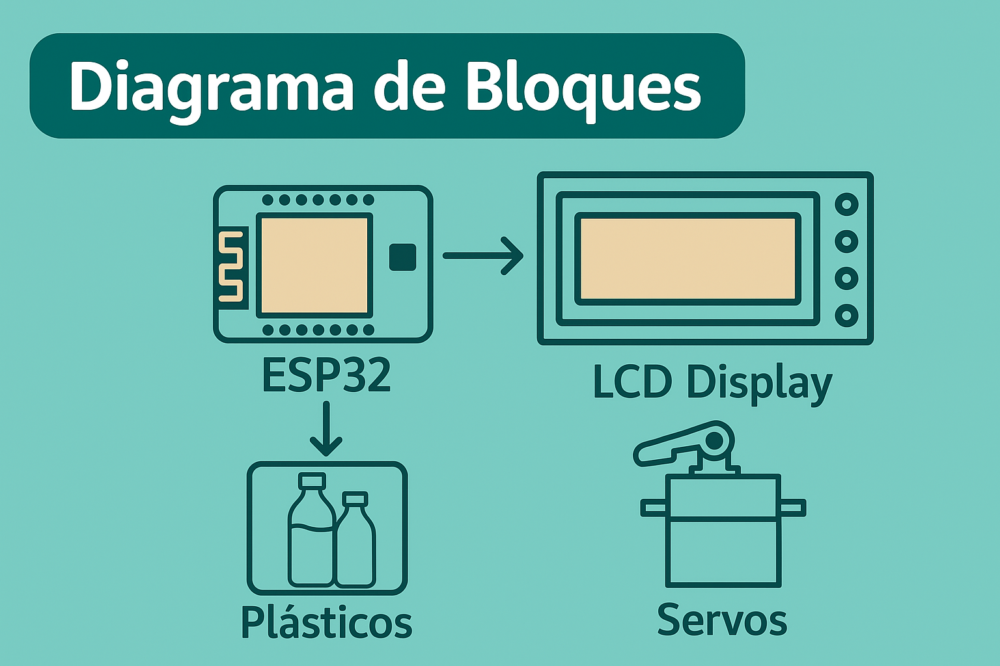
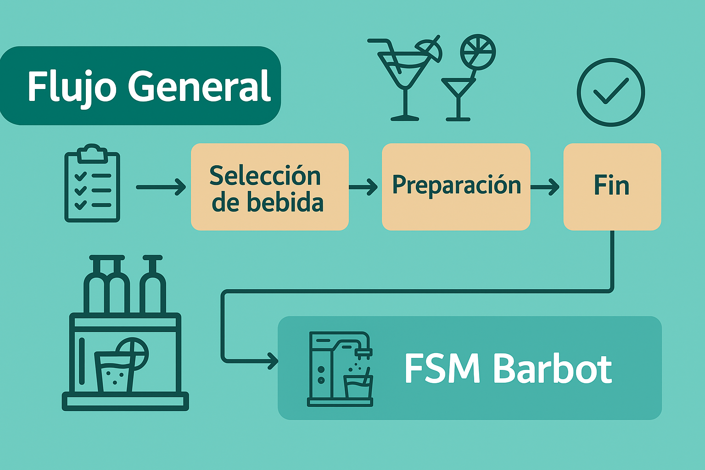
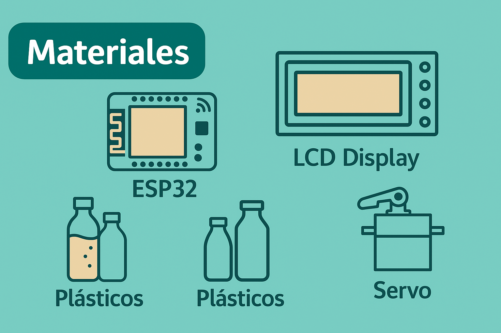
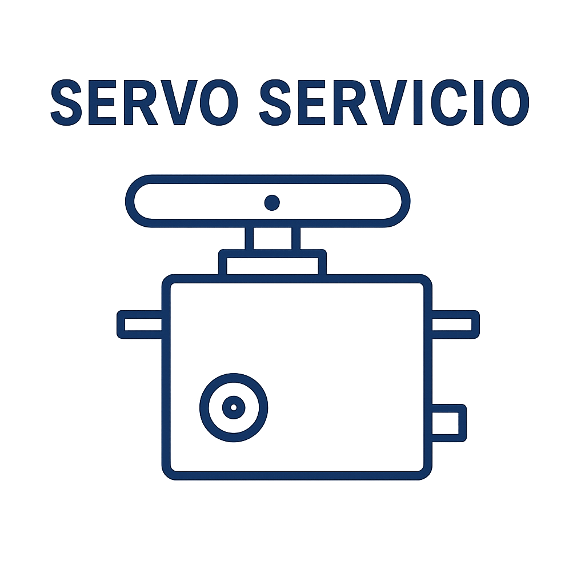

🍹 BarBot – Sistema Automatizado de Preparación de Bebidas
ESP32 • FreeRTOS • FSM • LCD I²C • Servo • Motor DC
 

🧠 1. ¿Qué es BarBot?

BarBot es un sistema embebido capaz de preparar bebidas mezcladas de manera automática, precisa y controlada.
Utiliza un carrusel de 6 botellas, sensores de posición, un servo presionador, un motor DC tipo limpiaparabrisas y una interfaz simple basada en LCD I²C y botones.

  

El cerebro del sistema es un ESP32 ejecutando FreeRTOS, mientras una FSM (Finite State Machine) organiza todo el flujo de decisiones.

🧩 2. Arquitectura General del Sistema

  

La arquitectura incluye:

Entradas → Botones, HOME, SLOT

Procesamiento → ESP32 + FSM + FreeRTOS

Actuadores → Motor DC y Servo

Interfaz → LCD 16x2 I²C

Recetas → Lógica 70% / 30%

🔄 3. Diagrama de Estados (FSM)

  

Estados principales:

ST_IDLE – Espera inicial

ST_BOOT – Inicialización

ST_HOME – Homing del carrusel

ST_MENU – Selección de bebida

ST_MOVE1 – Ir a botella 1

ST_DISPENSE1 – Servir alcohol (30%)

ST_MOVE2 – Ir a botella 2

ST_DISPENSE2 – Servir mezclador (70%)

ST_DONE – Trago completado

🧱 4. Diagrama de Bloques Funcional

  

Este diagrama muestra la relación:

Sensores → FSM → Actuadores

FSM → LCD → Usuario

Recetas → Control → Servo + Motor

⚙️ 5. Funcionamiento General del Sistema

  

Etapas:

Encendido

Homing automático

Menú de bebidas

Movimiento a botella 1

Servido 1

Movimiento a botella 2

Servido 2

“TRAGO LISTO”

🛠️ 6. Materiales Utilizados

  

Componente	Función
ESP32 DevKit	Control y procesamiento
Pantalla LCD I²C	Menú y estado del sistema
Servo SG90 / MG996R	Presionar dispensador
Motor DC tipo limpiaparabrisas	Rotación del carrusel
Final de carrera HOME	Posición cero
Final de carrera SLOT	Conteo de posiciones
Botones UP/DOWN/OK	Navegación por menú
Dispensadores tipo botellón	Salida de líquidos
Estructura mecánica	Carrusel y soporte
⏱️ 7. Lógica 70% / 30% (Tiempo de Servido)

  

Para cada receta se define:

bottlePos1 → botella de alcohol

pourMs1 → tiempo de alcohol (≈ 30%)

bottlePos2 → botella de mezclador

pourMs2 → tiempo de mezclador (≈ 70%)

Cálculo:

𝑉
=
𝑄
⋅
𝑡
V=Q⋅t

Esto hace que cambiar proporciones sea tan simple como editar recipes.cpp.

🧵 8. FreeRTOS y Multitarea

  

Tareas creadas
TaskBarbot (10 ms)

Ejecuta fsmStep()

Evalúa sensores

Controla motor

Controla servo

TaskHeartbeat

Parpadeo del LED

Indica vida del sistema

Gracias a FreeRTOS → Zero bloqueos / multitarea real.

🧱 9. Modularización del Código
BarBot/
 ├── src/
 │    ├── BarBot_FreeRTOS.ino
 │    ├── fsm.cpp
 │    ├── hardware.cpp
 │    ├── buttons.cpp
 │    └── recipes.cpp
 ├── inc/
 │    ├── fsm.h
 │    ├── hardware.h
 │    ├── buttons.h
 │    └── recipes.h
 ├── img/
 ├── docs/
 └── README.md

Ventajas:

✔ Claridad
✔ Escalabilidad
✔ Trabajo en equipo
✔ Profesionalismo

🧪 10. Pruebas Realizadas
Homing correcto

Conteo con SLOT estable

Servo calibrado

Tiempo de mezclas verificado

Simulación en Wokwi

Configuración de recetas

Integración de FreeRTOS

Menú con antirrebote

📊 11. Estado Actual del Proyecto
✔ Semicompletado

FSM funcionando

FreeRTOS integrado

Control de motor y servo

Antirrebote implementado

Recetas configurables

Simulación funcional

Documentación IEEE

README visual

⏳ Pendiente

Carcasa final

Ajuste del caudal real

Diagramas completos

Ensamblaje mecánico completo

🏁 12. Conclusiones

BarBot integra todos los conceptos clave de la materia:

Sensado

Actuación

Control

RTOS

FSM

Modularización

Comunicación I²C

Diseño embebido 

👤 13. Autores

Susann Baldiviezo – Lógica FSM

Florencia  Frigerio– Control del motor + validación de códigos

Benjamín Soruco – Servo + mecánica

Alejandro Bejarano – Documentación